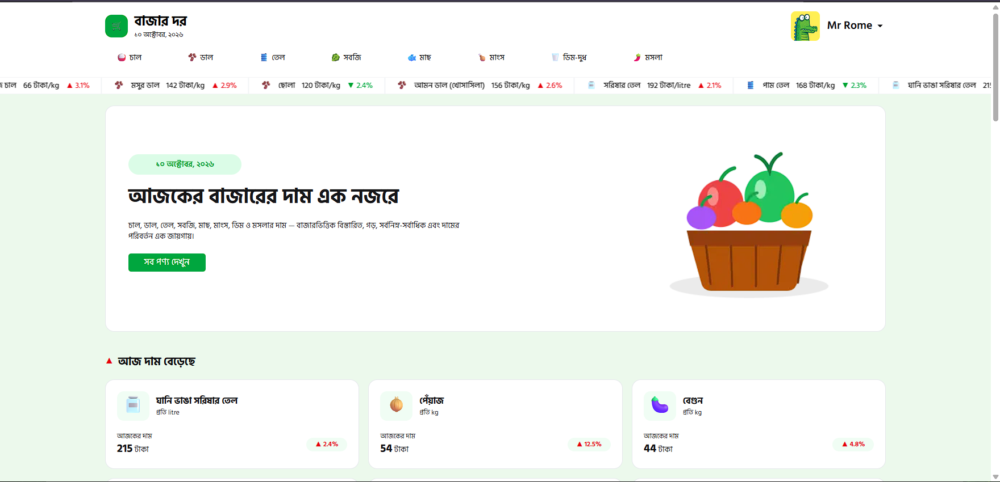
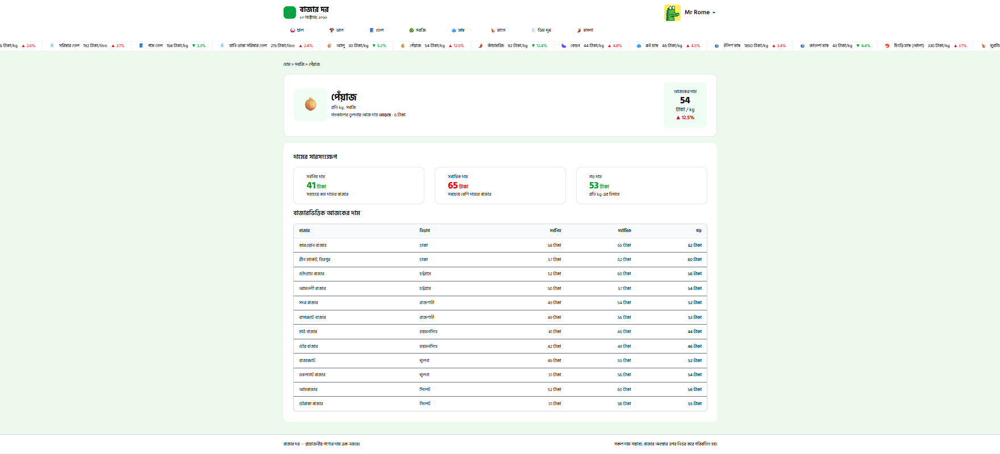
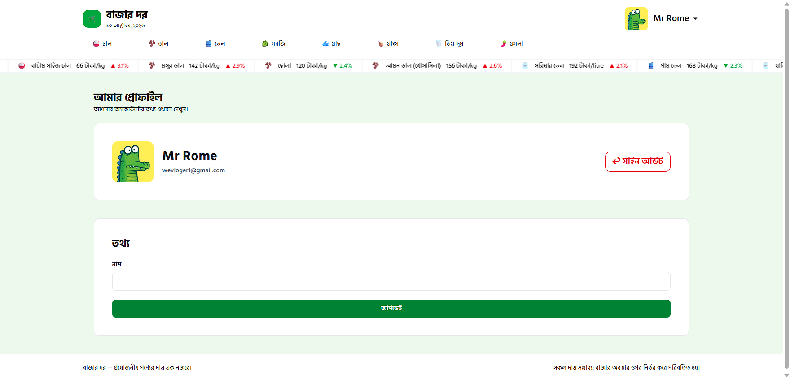
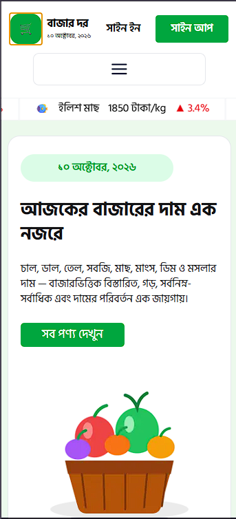
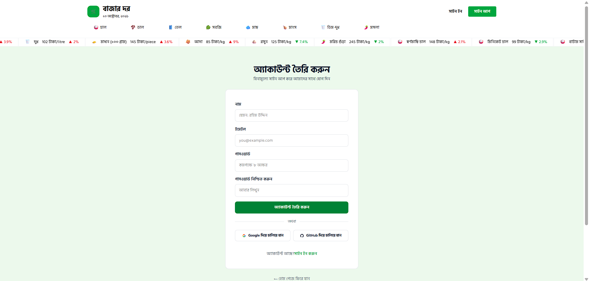
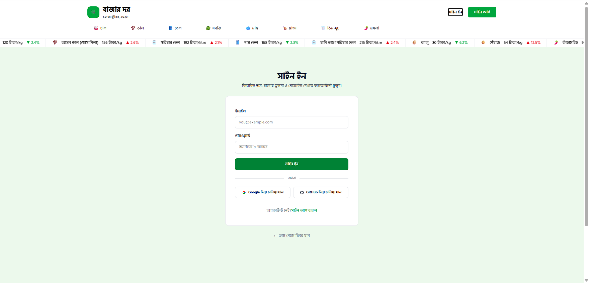

# 🛒 Bazar Dor

## 📌 About the Project

Bazar Dor is a web application designed to help users explore daily essential product prices and compare market prices across different divisions of Bangladesh.

The application displays product names and market information in Bangla using data provided directly by the API. Prices, measurement units, and percentage values are displayed in English format, while dates are displayed in Bangla date format. It provides category-based navigation and an easy-to-use interface for browsing essential commodities.

Built with Next.js, TypeScript, and modern UI libraries, Bazar Dor focuses on making market price information accessible through a responsive and user-friendly experience.

## 🔗 Live Project

- **Live Website:** https://bazardor-rouge.vercel.app/
- **GitHub Repository:** https://github.com/Rumi-Parvez/Assignment-of-PH-07-From-RumiParvez

## Home Page Screenshoot
<p align="center">
  
</p>


## 🛠️ Technologies Used

- **Next.js** — React framework for the application
- **React** — Component-based user interface
- **TypeScript** — Type-safe development
- **JavaScript** — Application functionality
- **Tailwind CSS** — Utility-first styling
- **HeroUI** — UI components
- **DaisyUI** — Tailwind CSS component library
- **React Icons** — Icon components
- **Gravity UI Icons** — Interface icons
- **React Marquee Text** — Scrolling text and ticker content
- **React Toastify** — Toast notifications
- **Better Auth** — Authentication
- **MongoDB** — Database integration for authentication
- **REST API** — Dynamic product and category data
- **HTML5 & CSS3** — Web structure and styling

## ✨ Core Features

- **Product Price Information:** Displays product names in Bangla using the API data directly.
- **Category-Based Navigation:** Allows users to browse products through product categories.
- **Current and Historical Prices:** Shows today's price alongside yesterday's, last week's, and last month's prices.
- **Price Change Indicators:** Displays price movement direction and percentage change.
- **Market-Wise Price Comparison:** Shows minimum and maximum prices across different markets.
- **Division-Based Market Data:** Includes market information associated with divisions of Bangladesh.
- **Bangla Date Formatting:** Displays dates in Bangla date format.
- **Dynamic API Integration:** Retrieves product and category information from REST API endpoints.
- **Scrolling Price Ticker:** Uses React Marquee Text for scrolling text content.
- **Toast Notifications:** Uses React Toastify to display feedback messages.
- **Authentication Integration:** Uses Better Auth for user authentication functionality.
- **Responsive Interface:** Designed to support mobile, tablet, and desktop screens.
- **Modern UI Components:** Uses HeroUI, DaisyUI, React Icons, and Gravity UI Icons.


## Product Page Screenshoot
<p align="center">
  
</p>

## 📊 Product Information

Each product can contain the following information:

- Product ID and slug
- Product name in Bangla, provided directly by the API
- Category name and category icon
- Measurement unit displayed in English format
- Today's price
- Yesterday's price
- Last week's price
- Last month's price
- Price movement direction and percentage change
- Market names and divisions in Bangla
- Minimum and maximum prices for individual markets

## 📈 Price Tracking

Bazar Dor presents price information from multiple time periods to make price movements easier to understand.

- **Today's Price:** The current listed price for the product.
- **Yesterday's Price:** The previous day's listed price.
- **Last Week's Price:** The listed price from the previous week.
- **Last Month's Price:** The listed price from the previous month.
- **Price Change:** Indicates whether the price has increased or decreased and displays the percentage change in English format.


## Profile Page Screenshoot
<p align="center">
  
</p>


## 🏪 Market Price Comparison

The product data includes market-wise pricing information, including:

- Market name in Bangla
- Division name in Bangla
- Minimum market price
- Maximum market price

This information helps users compare listed prices across different markets and divisions.

## 🔌 API Integration

Bazar Dor uses REST APIs to retrieve category and product data dynamically. Product names, category names, and market information are provided directly by the API in Bangla. The application does not rely on a language translation library to translate these values.

## 📦 API Data Structure

Bazar Dor uses API data to display product categories and market prices dynamically.

### Category Data

Category data is used to organize products and support category-based navigation.

Example category structure:

```json
[
  {
    "id": 1,
    "slug": "chal",
    "nameBn": "চাল",
    "icon": "🍚"
  }
]
```

*Note: This is an illustrative example of a category structure, not a verified copy of the actual category API response.*

### Product Data

Each product contains price information, category details, historical prices, and market-wise price ranges.

```json
{
  "id": 1,
  "slug": "sorno-machi-chal",
  "nameBn": "স্বর্ণমাছি চাল",
  "category": "chal",
  "categoryNameBn": "চাল",
  "categoryIcon": "🍚",
  "unit": "kg",
  "image": "🍚",
  "today": 148,
  "yesterday": 145,
  "lastWeek": 142,
  "lastMonth": 138,
  "change": {
    "dir": "up",
    "pct": 2.1
  },
  "markets": [
    {
      "market": "কারওয়ান বাজার",
      "division": "ঢাকা",
      "min": 146,
      "max": 165
    },
    {
      "market": "গ্রীন মার্কেট, মিরপুর",
      "division": "ঢাকা",
      "min": 143,
      "max": 159
    },
    {
      "market": "চৌদগ্রাম বাজার",
      "division": "চট্টগ্রাম",
      "min": 142,
      "max": 163
    }
  ]
}
```

### Product Data Fields

- `id` — Unique product identifier.
- `slug` — URL-friendly product identifier.
- `nameBn` — Product name in Bangla.
- `category` — Category identifier.
- `categoryNameBn` — Category name in Bangla.
- `categoryIcon` — Category icon.
- `unit` — Product measurement unit.
- `today` — Today's listed price.
- `yesterday` — Yesterday's listed price.
- `lastWeek` — Last week's listed price.
- `lastMonth` — Last month's listed price.
- `change.dir` — Price movement direction.
- `change.pct` — Percentage change.
- `markets` — Market-wise pricing information.
- `markets[].min` — Minimum listed market price.
- `markets[].max` — Maximum listed market price.

The application uses this data structure to present product information, price trends, and market comparisons in an accessible interface.

## 🧩 UI and User Feedback

- **HeroUI:** UI components for building the interface.
- **DaisyUI:** Ready-to-use Tailwind CSS component styles.
- **React Icons:** Icons used throughout the application.
- **Gravity UI Icons:** Additional interface icons.
- **React Marquee Text:** Scrolling ticker content.
- **React Toastify:** Toast notifications for user feedback.

## 📱 Responsive Design

The application is designed to provide a consistent browsing experience on:

- Mobile devices
- Tablets
- Desktop computers

## Mobile view Screenshoot
<p align="center">
  
</p>


## 🔐 Authentication and Database

The project integrates Better Auth for authentication and MongoDB for authentication-related database operations.


## SignUp - SingIn Page Screenshoot
<p align="center">
  
</p>
<br>
<hr>
<p align="center">
  
</p>

## 👨‍💻 Developer

**Name:** Rumi Parvez

**GitHub:** [Rumi-Parvez](https://github.com/Rumi-Parvez)

**Email:** openyhoolceo@gmail.com

**About Me:**

I'm a web development learner who enjoys exploring new technologies and building practical web applications. I work with React, Next.js, TypeScript, and modern frontend tools while continuing to improve my development skills through hands-on projects.

## 🔗 Project Links

- **Live Website:** https://bazardor-rouge.vercel.app/
- **GitHub Repository:** https://github.com/Rumi-Parvez/Assignment-of-PH-07-From-RumiParvez
